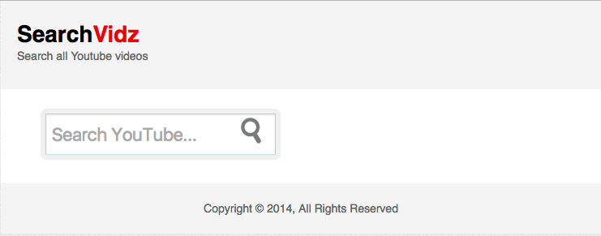

# Personal YouTube

This app is a personal Youtube, run within Youtube API. I made it as my personal practice on Javascript and jQuery. I added the comment to almost every line of my JS code, so it can be very for beginner to understand it.
 __Technology used for app:__
- __HTML__
- __CSS__
- __jQuery__
- __AJAX__
- __Youtube API__
- __jQuery  [fancy box](http://fancybox.net) plugin__

